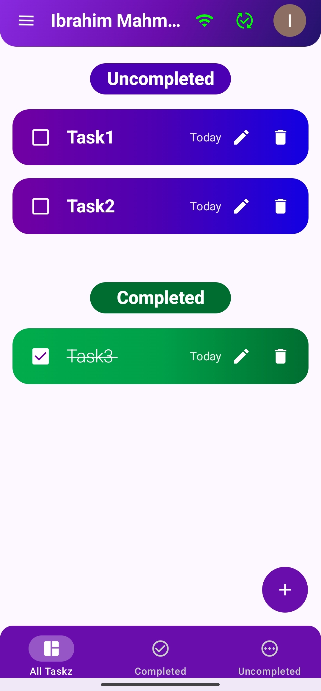
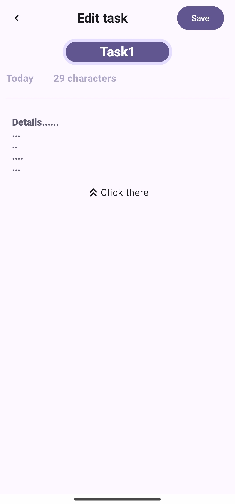
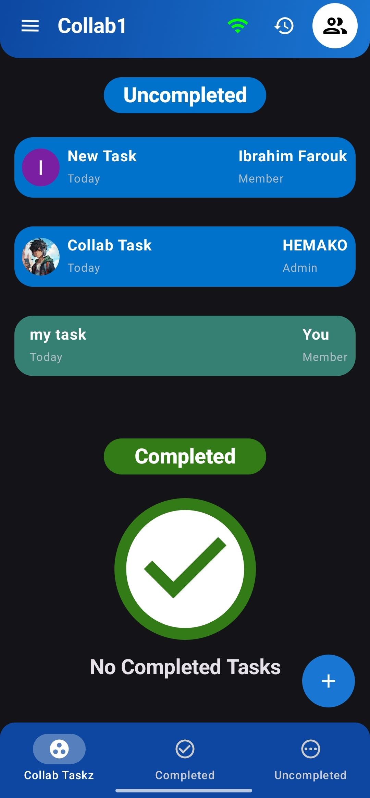
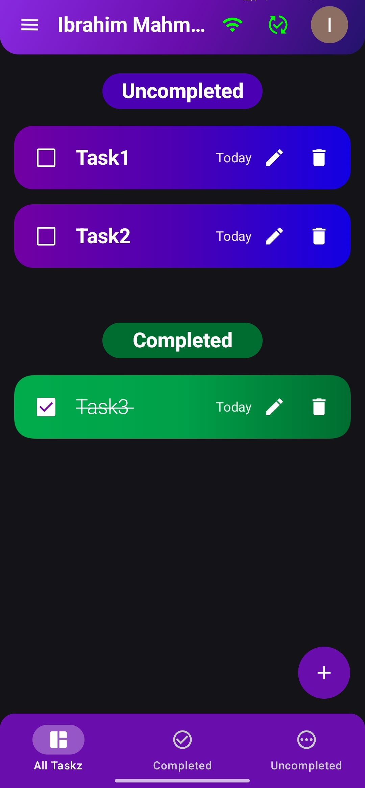
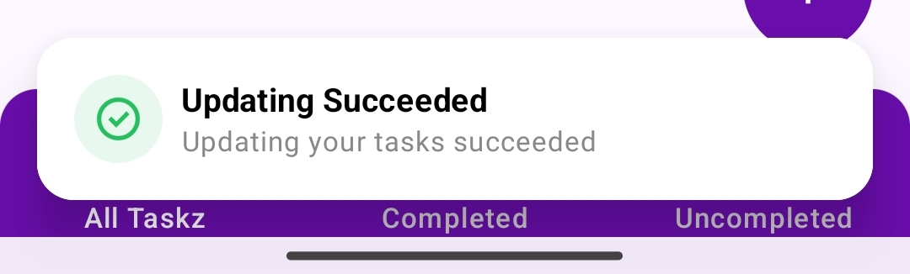
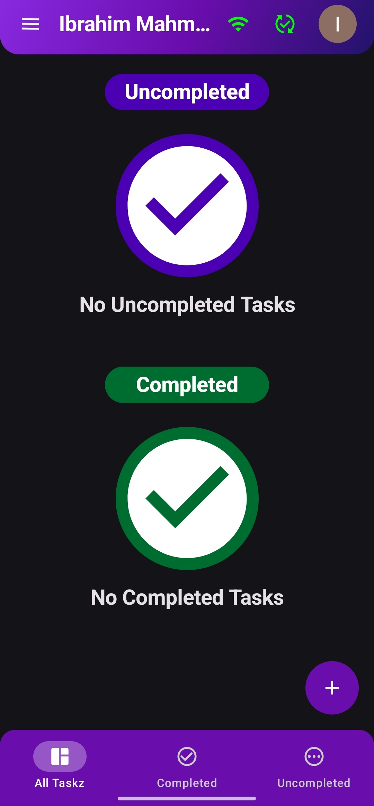

# Taskly 🚀

**By: Ibrahim Mahmoud (Black Cat)**

Welcome to **Taskly**, your personal productivity companion! Whether you’re managing daily tasks or collaborating with a team, **Taskly** ensures you stay on top of everything with ease and style. 🎯

---

## 🌟 **Features You'll Love**

- **💎 Seamless UI**: A clean, modern interface crafted with **Jetpack Compose** for a smooth, responsive experience.
  
- 📡 **Seamless Online & Offline Mode** – Access your tasks anytime, even without an internet connection. Once you're online, your tasks sync automatically across devices.
  
- 🔥 **Sync With Google Account** - Sign in to your google account to not losing your progress
  
- **🔒 Google Integration**: Secure sign-in via Google, making it easy to access your tasks across devices.
  
- **☁️ Firebase Integration**: Real-time synchronization and cloud storage to keep your data safe and accessible anywhere.
  
- 👥 **Optimize your tasks with collabs** - create and join collabs with your friends like a group with real-time updates **Don't forget to tell your team**😉
  
- 🎯 **Minimal & Fast** – A lightweight app with everything you need and nothing you don’t.
  
- **📲 Real-Time Updates**: Stay in sync with **live database updates** and instant notifications.
  

## 🚀 **What’s Coming Next? (🔥 Stay Tuned!)**

We’re working on some exciting features that will take your productivity to the next level:

- 📈 **App Widgets** - cotrol your app with faster with customizable widgets on the home screen

- 📁 **Categorize Your Tasks** - sort your tasks as you like with more categories that you make

- 💻 **Adaptive layout** - Use your app on any android device with custom layouts for tables, mobiles and foldables

- 🌙 **More Themes** – Customize your experience with beautiful new themes!

- 🗂 **Advanced Filtering & Sorting** – Find tasks instantly with advanced filters & smart search!
---

### 🛠 Technologies Used:

- **Kotlin** 🟢
- **Jetpack Compose** 🖤
- **Firebase** 🔥
- **Google Sign-In** 🔑

---

### 📱 About the App:

Taskly is built with **Kotlin** and **Jetpack Compose** for a lightning-fast, fluid user experience. With **Google Sign-In** and **Firebase** integration, your tasks are securely stored and synced across devices. Whether you're handling your personal to-do list or working with a team, Taskly’s **collaboration feature** and **real-time updates** ensure smooth teamwork and seamless productivity. ✨

---

### Screenshots 📷

| Home Screen | Task Edit | Collaboration |
|------------|--------------|--------------|
|  |  |  |

| Dark Mode | Snackbar | No Tasks |
|----------|--------|--------------|
|  |  |  |

---

### 🔗 Check Out the Old Version:

You can find the previous version of Taskly here: [[URL FOR OLD REPO](https://github.com/BIackCatt/Todo-Android-App)] 🔄

---

### 🤝 Contribute:

Feel free to open issues, submit pull requests, or give feedback! Together, we can make Taskly even better. 💬

---

### 📜 License:

This project is licensed under the [Apache License 2.0](https://www.apache.org/licenses/LICENSE-2.0). See the [LICENSE](LICENSE) file for more details.

---

### 👨‍💻 Let's Stay Connected:

 - 
 - 
   
 Feel free to DM me for any suggestions, ideas, or just to say hi! 😄
 
---

🎯 Love Taskly? Give it a ⭐ on GitHub and share your feedback!

Thank you for checking out **Taskly**! Let’s make task management enjoyable and productive! 💪

